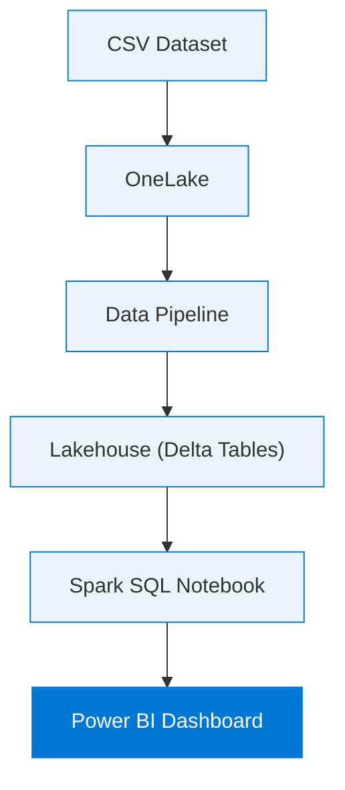

<div align="center">

# 📦 SmartDelivery360

### Online Orders & Delivery Delay Analysis — built end-to-end on Microsoft Fabric


</div>

---

## Table of Contents

- [Overview](#overview)
- [Business Problem](#business-problem)
- [Tech Stack](#tech-stack)
- [Architecture](#architecture)
- [Repository Structure](#repository-structure)
- [Dataset & KPIs](#dataset--kpis)
- [Dashboard](#dashboard)
- [Key Insights](#key-insights)
- [How to Reproduce](#how-to-reproduce)
- [Skills Demonstrated](#skills-demonstrated)
- [Roadmap](#roadmap)
- [Author](#author)

---

## Overview

SmartDelivery360 is an end-to-end analytics project for a simulated eCommerce platform. It was built to identify what's driving delivery delays, how shipping cost affects margins, and which channels, regions, and customer segments actually generate revenue — using the full Microsoft Fabric stack from raw data to a published Power BI dashboard.

It doubles as hands-on practice for the **DP-600 (Fabric Analytics Engineer)** certification: every concept in the exam syllabus shows up somewhere in this pipeline.

## Business Problem

An eCommerce platform tracking online orders, delivery times, and product logistics needed visibility into:

- [ ] Which regions generate the most revenue?
- [ ] Which orders are delayed, and why?
- [ ] Which sales channel performs best?
- [ ] Do premium customers generate more revenue?
- [ ] How much is being spent on shipping cost?

## Tech Stack

| Layer | Component | Purpose |
|---|---|---|
| Ingestion | **Fabric Data Pipeline** | Load raw order/shipment data into the Lakehouse |
| Transformation | **Spark SQL notebook** | Clean, dedupe, join, and shape the data |
| Storage | **Delta Tables** (OneLake) | ACID-compliant, versioned storage |
| Semantic layer + reporting | **Power BI** | KPIs, DAX measures, interactive dashboard |

## Architecture

Medallion architecture (bronze → silver → gold) implemented natively on Fabric:



| Stage | What happens |
|---|---|
| **Bronze** | Raw order/shipment CSVs ingested via Data Pipeline into OneLake |
| **Silver** | Spark SQL cleans, deduplicates, and joins order + shipment tables |
| **Gold** | Business-ready aggregates stored as Delta Tables |
| **Serve** | Power BI connects to the gold layer for the semantic model + dashboard |

## Repository Structure

```
SmartDelivery360/
├── README.md
├── notebooks/
│   └── spark_transformations.ipynb     # Spark SQL cleaning & transformation logic
├── pipeline/
│   └── pipeline_config.json            # Data Pipeline definition / screenshots
├── powerbi/
│   └── SmartDelivery360.pbix           # Power BI report file
├── data/
│   └── sample_orders.csv               # Anonymized sample dataset
└── assets/
    └── dashboard-screenshot.png        # Dashboard preview used below
```

> Structure below now matches the files included in this package. Add your `.pbix` and pipeline
> export into `powerbi/` and `pipeline/` once you export them from Fabric.

## Dataset & KPIs

> **Note:** `data/sample_orders.csv` is a synthetic, anonymized dataset generated to closely
> approximate the aggregates shown in the dashboard below (not the original raw export). Row-level
> figures will differ slightly from the screenshot; the KPI totals match closely by design.

| Metric | Value |
|---|---|
| Total customers | 17 |
| Total orders | 25 |
| Total quantity | 121 |
| Total shipment cost | 422.85 |
| Delayed orders | 11 (**44%** of total orders) |

## Dashboard


The Power BI report includes:

- KPI cards — customer count, total quantity, total orders, total shipment cost, delayed orders
- Total orders vs. delayed orders by region (clustered bar)
- Total revenue by region (donut)
- Total revenue vs. revenue from discounted orders by region (clustered bar)
- Total revenue by order channel (donut)
- Delayed orders by order channel (donut)
- Total revenue by premium customer status (donut)

## Key Insights

| Finding | Detail |
|---|---|
| 📱 **Mobile App is a delay risk, not a revenue driver** | Accounts for 45% of delayed orders but only 23% of total revenue |
| 🌍 **Revenue is regionally concentrated** | North alone drives ~39% of total revenue; South trails at under 8% |
| ⭐ **Premium customers punch above their weight** | ~45% of total revenue from the smaller customer segment |

## How to Reproduce

1. Clone this repo and open (or create) a Lakehouse in your Fabric workspace.
2. Upload `data/sample_orders.csv` to **Files → raw/** in the Lakehouse.
3. Attach `notebooks/spark_transformations.ipynb` to the Lakehouse and run all cells — it builds
   the bronze → silver → gold Delta tables (`bronze_orders`, `silver_orders`, `gold_region_summary`,
   `gold_channel_summary`, `gold_premium_summary`).
4. In Power BI Desktop, connect to the Lakehouse's gold tables (Direct Lake or import) and rebuild
   the visuals, or open `powerbi/SmartDelivery360.pbix` once you've exported it and repoint its
   data source.
5. Optional: wire step 3 into a Fabric Data Pipeline for a scheduled refresh.

## Skills Demonstrated

Mapped to DP-600 (Fabric Analytics Engineer) exam domains:

- Lakehouse and OneLake fundamentals
- Delta table creation and management
- Data pipeline orchestration for ingestion
- Spark SQL for transformation logic
- Power BI semantic modeling and DAX
- Dashboard design for stakeholder consumption

## Roadmap

- [ ] Convert delay counts to a delay-rate % by region (raw counts currently understate South's risk given its smaller order volume)
- [ ] Add row-level security (RLS) by region as a governance layer
- [ ] Schedule automated pipeline refresh
- [ ] Expand to a larger, multi-year dataset

## Author

**Sanchit Kumar** — B.Sc. Life Sciences (Data Science track), building toward a Data Scientist / AI Engineer role.
Built as part of Microsoft DP-600 certification prep and ongoing data science portfolio development.

Connect on [LinkedIn](#) · More projects on [GitHub](#)

---

<div align="center">

*If this was useful, consider starring the repo ⭐*

</div>
